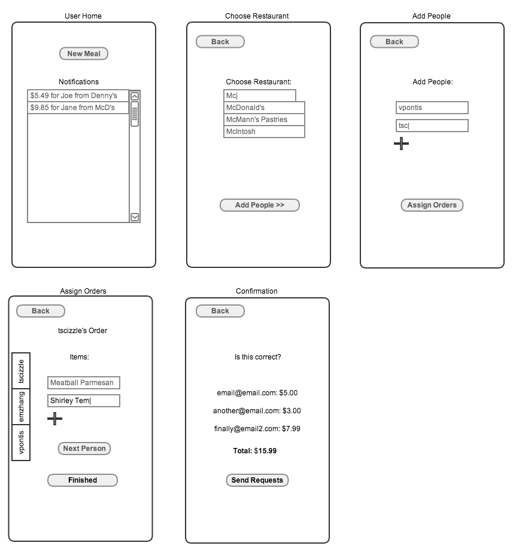

MealSplit - Phase 1 Design Doc
==============================
Authors
-------
+ Victor Pontis
+ Tyler Singer-Clark
+ Emily Zhang

Purpose and Goals
=================
Purpose
-------

Problem: A group of friends go to a restaurant and get a single bill. Each wants to pay for their meal, but calculating the cost of what they ordered involves passing around the receipt and a lot of tedious calculation. People know what they ordered but they don’t know how much it cost and don’t want to factor in multiple items and tax. 

Solution: MealSplit makes the task of splitting the cost of a meal easy. Using MealSplit people at a meal do not have to remember the cost of their items, they simply remember what they ordered and MealSplit will do the job of calculating the cost. MealSplit also loads the menu of a restaurant so when a user is entering in their food items the app will autocomplete to expedite the process. And to avoid the annoying situation where your friend “forgot to pay you back” MealSplit will send an invoice to all of the participants involved. 

Motivation for Development 
--------------------------

###Current Solutions

+ People paying cash
+ Asking for split checks
+ One person paying for everyone
+ Technological
  + Venmo
  + GroupMe
  + Plates App (by Splitwise)

###Problem with Current Solutions

The current solutions require each person to calculate how much they spent based on the cost of their items. This requires every person to look at the receipt or remember the cost from the menu. They also have to incorporate tax and figure out how to split common costs. 

###Description of system to be build
MealSplit will make keeping track of IOUs after a shared meal easier. Below we describe what we plan to include in our MVP and then in our final full-featured application.

####MVP
Our MVP will be an app for all meal-participants to use. The meal-payer will load our app, enter a restaurant name, and food items for each person. MealSplit will then email the meal-payer a summary of the meal and the meal-participants their individual charges, with tax and tip precalculated. 

####Full-Feature App
MealSplit’s full-feature app has many different possibilities of improvement upon the MVP. It will definitely include:

+ sessions for each user: users should be able to log in and out of the app and see their past transactions, completed and incomplete. 
+ a better way to pull data from a menu, either through the Locu API or by letting restaurants log in as a superuser to change the menu items 

Other ideas we might implement: 

+ connecting with the Square Cash or Venmo API to complete charges
+ pinging people for uncompleted charges
+ uploading pictures of receipts to attach to charges
+ OCR receipts to identify menu items

Context Diagram
---------------

Our context diagram has our MealSplit app in the middle. Meal-payers comes to MealSplit and enter in the information about the meal: who was involved and what items were ordered. MealSplit pulls menu and food item information from Locu about restaurant menus and items and also allows for restaurants to enter in their menu information. This data allows for autocompletion of the user’s inputs and automatically calculates prices and taxes. After a meal is completed, MealSplit will then email the meal-payer a summary of the meal and who owes them money as well as emailing an invoice to everyone involved with the meal. 

Key Concepts
------------

One of the benefits of MealSplit is that it does not really introduce any foreign concepts. The users of MealSplit should intuitively understand the different components and concepts in MealSplit. Below we outline our four main concepts. 

+ Restaurant
  + Each restaurant has a list of `food items` which it serves. A `meal` is at a `restaurant`.
+ Meal
  + A `meal` consists of a group of people eating at a restaurant together. They all pay on one tab and one person orders. Everyone at the meal orders there own food and may have one or more `food items`.
+ Food item
  + At a `restaurant` a person orders one or more several `food items`. A food item has a name and a price. `Food items` can also be split between people.
+ Owing money for meal
  + At each `meal` one person pays for everyone else so the other participants of the meal all owe the meal-payer for their portion of the `meal`.

Data Model
----------

Our data model has six different kinds of objects: payment requests, meals, meal-payers, meal-participants, restaurants and food items. The diagram above captures their relationships but we will shortly elaborate on how each object interacts with other objects. 

Each meal has one or more payment requests that correspond to participants in the meal owing the meal-payer the amount of their meal. Each payment request is tied to a unique meal. A meal also has one restaurant where the group ate. But a restaurant can have multiple meals. 

A meal also includes a group of people. We represent them as a meal-payer and meal-participants. A meal-payer is the one who paid for the meal and is entering the information in on the application. The leader is looking to get payment back from the other meal-participants. Every meal has one meal-payer and a meal-payer object corresponds to exactly one meal. A meal-payer is a subset of meal-participants. There can be one or more meal-participants in every meal and a meal-participant can be involved in one meal. The meal-participant object is unique to the meal. In the future if we want to have users of the system the meal-participant will also have a user id field that will link it to a user. 

A restaurant then has a list of one or more food items. Each food item only belongs to one restaurant. And then each meal-participant can have one or more food items that he or she ordered during the menu. Each food item corresponds to one or more meal-participants. 

Feature Descriptions
---------------------

**Creating charges for a group:** The meal-payer can create separate charges for anyone who participated in the meal easily  
**Emails for group charges:** People who owe the meal-payer money receive an email detailing their meal charge  
**Preloaded data wherever possible:** Restaurant names will be preloaded for ease of selection. Menu items and prices can be preloaded for ease of selection. Usernames/emails will also be preloaded if possible  
**Autocompletion:** MealSplit will use autocompletion to make entering in restaurants and food items as simple as possible. When you start typing `chi` the selection for `Alfredo Chicken Pasta` will pop up and you can simply select that item.
**View past transactions:** Users will eventually be able to see their past transactions and levels of completion of each.  
**User accounts:** Users can log in and out to privately view their transactions
**Unpaid transaction reminders:** User will receive notifications about their incomplete transactions until they mark them as completed. (Full-featured app)

Security Concerns
-----------------

###General
+ Injection 
  + We will handle injection attacks by using the Rails ORM and escaping user input.

###MVP
+ Fake meals created and charges sent
+ Changing restaurant information and prices
  + only allowing superusers to upload data or pull from Locu

### Full-featured App
+ Fake meals created and charges sent 
  + Only registered people can send requests
  + Detection if someone is creating fake and high density of charges
  + Only autocompletes names of friends and past transactors
+ Generic account security (e.g. making passwords are hashed, making sure passwords are secure enough, etc.)
+ A malicious party deliberately entering fake restaurant/meal data
  + Only allowing superusers to upload data or pull from Locu

User Interface
--------------
###User Workflow

The workflow starts with a login, which routes to the user home on successful authentication, and routes back to login page on unsuccessful authentication.

Clicking the button `New Meal` brings the user to a page for choosing the restaurant, which has a text box to type (and autocomplete) the restaurant name. Clicking `Next` brings the user to a page for adding people to the meal, which has text fields for usernames and a plus button to add another person.

After inputting the restaurant and people, the user is brought to a page for assigning menu items to each participant in the meal. There will be tabs on the side, one for each person, and the group each takes turns putting in what they ordered. After everyone has gone, the user clicks `Finish Meal` and is brought back to their home page.

Each step in the standard process includes the ability to take a step back and undo. At each step, before rendering the next page, the information that was input must be validated, and if it fails the validation (for blank input, invalid characters, etc.) the same page is rendered with a message to the user about the specific error.

###Wireframes

The user home page has a button for starting a meal, and a list of notifications, which are payments owed from past meals.

The first step in creating a meal is choosing the restaurant, which has autocomplete using the list of available restaurants. Then the user puts in usernames of all the participating users.

Once the restaurant and participants are chosen, menu items can be added to each user, with a tab list on the side for choosing the current person to add order to.

For safety, there is a standard confirmation page.
