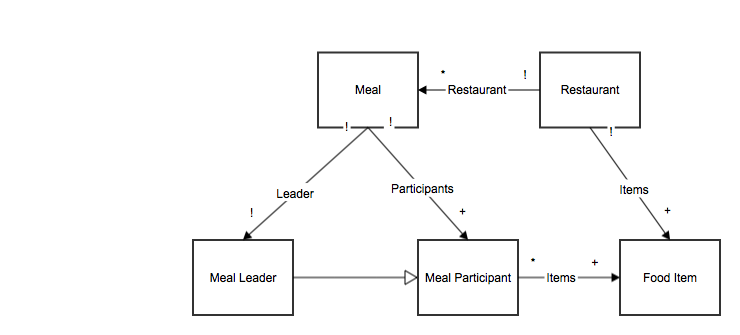

MealSplit - Phase 2 Data Model
==============================
Authors
-------
+ Victor Pontis
+ Tyler Singer-Clark
+ Emily Zhang

Data Model
----------

Our data model has six different kinds of objects: payment requests, meals, meal-payers, meal-participants, restaurants and food items. The diagram above captures their relationships but we will shortly elaborate on how each object interacts with other objects. 

Each meal has one or more payment requests that correspond to participants in the meal owing the meal-payer the amount of their meal. Each payment request is tied to a unique meal. A meal also has one restaurant where the group ate. But a restaurant can have multiple meals. 

A meal also includes a group of people. We represent them as a meal-payer and meal-participants. A meal-payer is the one who paid for the meal and is entering the information in on the application. The leader is looking to get payment back from the other meal-participants. Every meal has one meal-payer and a meal-payer object corresponds to exactly one meal. A meal-payer is a subset of meal-participants. There can be one or more meal-participants in every meal and a meal-participant can be involved in one meal. The meal-participant object is unique to the meal. In the future if we want to have users of the system the meal-participant will also have a user id field that will link it to a user. 

A restaurant then has a list of one or more food items. Each food item only belongs to one restaurant. And then each meal-participant can have one or more food items that he or she ordered during the menu. Each food item corresponds to one or more meal-participants. 

### MVP Specific Section
In our data model for the MVP, we have removed the Payment Request model. We realized that the payment request gets constructed and then used for the last time in quick succession, so there is no need to persist it as a model in the database. Its information is held in the other models, so the calculations can happen, and the request can be sent out, without the idea of a Payment Request object. Since simpler is better when there are unnecessary things, we chose to scrap it for Phase 2. Perhaps in the final version, if there are user accounts that would like to remember what payment requests are pending, have ever existed, etc., the idea of a Payment Request object might be more relevant and useful, but for our MVP it makes the most sense to not include it in the data model.
