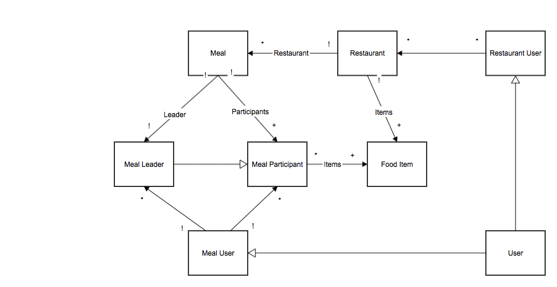

MealSplit Phase 3 - Final Version
=======================

Authors
-------
+ Victor Pontis
+ Tyler Singer-Clark
+ Emily Zhang

Purpose
-------

Problem: A group of friends go to a restaurant and get a single bill. Each wants to pay for their meal, but calculating the cost of what they ordered involves passing around the receipt and a lot of tedious calculation. People know what they ordered but they don’t know how much it cost and don’t want to factor in multiple items and tax. 

Solution: MealSplit makes the task of splitting the cost of a meal easy. Using MealSplit people at a meal do not have to remember the cost of their items, they simply remember what they ordered and MealSplit will do the job of calculating the cost. MealSplit also loads the menu of a restaurant so when a user is entering in their food items the app will autocomplete to expedite the process. And to avoid the annoying situation where your friend “forgot to pay you back” MealSplit will send an invoice to all of the participants involved. MealSplit will also store your previous meals so if you forgot who you went to dinner with last Tuesday, MealSplit will let you know.

Instructions for testing final version
--------------------------------------

1. Go to: http://mealsplit.herokuapp.com/
2. Click Login on the right in the navbar and sign-up for an account.
3. Confirm the sign-up by clicking the link in the confirmation e-mail. This brings you back to the app where you can now log in.
4. You can now follow the steps in the Phase 2 docs regarding starting a meal, adding participants and food items, and sending out the request emails.
5. Additional features to try out: changing the tip on the meal summary page at the end, changing the payer for the meal on the meal summary page, going back and modifying participants and their orders even after going to the meal summary page.
6. If you want to modify the items on a menu, sign in with  email `vpo.ntis@gmail.com` and password `mealsmeals`. Then navigate to the restaurant page and try modifying the entries for `El Pelon Tacqueria`. (We also have admin accounts that can add/delete restaurants but we have not set these up for testing. Email us if you want to test an admin account.)

What we have added since the MVP
--------------------------------

- We now have user accounts and login functionality. Beyond sending and receiving e-mails, and calculating everyone’s cost, MealSplit now allows login and sessions, for these users it remembers past meals, shows a list of who you owe and how much for each person, stores standard info like e-mail and name. 

- The app now includes pages for viewing available restaurants and menus. One page lists the available restaurants and their city. Clicking on any of the restaurants brings you to a menu for that restaurant. This page lists the available food items at the restaurant, along with the price of each item.

- We know have a UI for restaurant administrators that will allow restaurant administrators to modify the restaurant’s menu. They will be able to add and remove food items from the restaurant’s menu. (This introduces some problems with participants. For instance, if a participant has a food item and the item is then deleted, this will cause problems within the app. We wanted to have the UI for restaurant administrators but did not have time for participants to store the actual food items themselves. This is a problem that will need to be fixed in future iterations of the app.)

- Some more minor improvements from the MVP include live display of tip changes (the tip shows up on the meal summary page and updates in real time when the tip input is changed). Also the payer of the meal is now chosen on the meal summary page. This allows the participants to enter in the food items over the course of the meal then decide who pays when they get the receipt. 

- There were also many UI changes, cosmetic and major, giving the app a more professional look/feel, and smoothing out the workflow (easier navigation from step to step and correcting mistakes in the input).

Feature Descriptions
--------------------

+ User accounts
  + A user can sign up for an account, which will be linked with the e-mail they provide, as well as a name they input. The name is used for personalization, and the e-mail acts like an ID, so e-mail uniqueness is a requirement. 
  + User accounts are linked to participants by email. If you enter in a participant email that has a linked user account, the user name will appear next to the email.    

+ Login/sessions
  + Standard login/logout functionality to remember who is logged in and to which user account they have access
  + A recently created meal is linked to the session it is created in. Only the session that created the meal and the participants of a meal can edit and view a meal. 

+ Past meal persistence
  + When logged in to their account, a user can see a list of their past meals. They can see who ordered what and how much everything cost, and tax and tip; all the relevant details.

+ Charges owed
  + A user can view who they owe for past meals, as well as how much they owe. This information could be determined just from viewing past meals, but that is a hassle, so we calculate it for the user and display a readable list on their profile page.

+ Restaurant viewing
  + Available restaurants are now displayed as a list, accessible via the navigation bar. This list shows the city for each restaurant, as well. Clicking a specific restaurant brings you to a page with more information about the clicked restaurant.

+ Menu viewing
  + For each restaurant, a menu is available by clicking the restaurant name in the restaurant list. The available food items appear in a list, each with their associated cost.

+ Tip display
  + On the meal summary page, where a tip percentage can be chosen, this tip’s contribution to total costs is displayed instantly when clicking one of the tip buttons (0, 10, 15, or 20).
  + We chose to have the tip to be preset values to simplify the experience. We asked a variety of people and the majority of users did not want to leave tips outside these 4 set percentages.

+ Still includes the features from Phase 2 MVP

Final Version data model
------------------------

- Just like the MVP, there are restaurants, food items, meals, participants, and users, connected in the same ways. The Final Version, with the addition of features such as login/sessions, accounts, remembering of past meals and charges, the data model got the important addition of the User model. This represents a user of the app, and allows for account information and history to be stored. A User is connected to the app functionality (meal creation and participation) either by being a Participant (payer or not).
- A User creates meals, leads meals, participates in meals, gets payment requests via e-mail, etc. A Participant is now the connection between User and Meal. Each Participant is associated with a single User, but a User can be associated with many Participants (because a User could be associated with many different meals).
- See updated data model

Security Concerns
-----------------

##Security Policy

+ In this version of the app, we added in sessions for all users, as well as the ability to administer a restaurants menu, who has the permission to add or remove menu items from a restaurant. Users must log in to see all of their past meals. Users must also sign up and confirm their email addresses via confirmation link before logging in for the first time. In order to become an restaurant user who can edit the menu of the restaurant, a user must be approved from the backend, preventing anyone from changing the menu. A user wishing to be the administer for a restaurant will email the administrators of MealSplit proof that they are affiliated with the restaurant. The MealSplit administrators will then allow that user to access the restaurant from the console.

##Threat Model

+ Malicious users might try to create many fake meals and receipts in an attempt to trick people into paying them for meals.
+ A user may try to create an account with another person’s email to see where they have been eating and with whom.
+ Malicious users might try to create many fake accounts from which to send out receipts.
+ Users might try to gain restaurant user status and change the restaurant’s menu.
+ In the form fields, users might try to inject SQL to create changes to the database.
+ Third parties might try to steal data passed to and from MealSplit

##Mitigation

+ SQL Injections
  + All of our Active Record queries are sanitized to prevent SQL calls from being injected into a query.

+ XSS 
  + In Rails 4, strong parameters allows us to ‘whitelist’ specific parameters in mass assignment. Strings in rendered in views in Rails 4 are also automatically HTML escaped by default. Rails 4 has other built-in protections from XSS attacks. 

+ CSRF
  + In our application controller, we have the protect_from_forgery with: :exception that calculates a security token to prevent CSRF. This is another feature built into Rails 4. 

## Password Safety

+ Password Certainty
  + Problem: When a user signs up for an account, they could unknowingly mishit a key because of hiding letters, and create an account for which they do not know the password.
  + Solution: Require a password confirmation, because the chance that they make the exact same mistake twice is very unlikely, so if the user types the same thing twice then it is almost definitely what they intended.

+ Password Anonymity
	
  + Problem: A user’s password must be checked on each login, so the database must remember enough information to check it, and if this information is the password itself, then users’ passwords are vulnerable, which is especially bad if they use the same password for other things like online banking, etc.
  + Solution: Encrypt passwords before storing in the database, because an encryption can allow for checking password on login, but disallow reverse-engineering into the password itself (assuming certain things about encryption, for example that there is a 1-way nature to the hash used on the password to encrypt it).

+ Packet Sniffing and XSS
  + Our app uses HTTPS and encrypts requests and responses, preventing third parties from accessing and collecting the data, thus preventing man-in-the-middle attacks. 

Design Challenges
-----------------  

+ How should a user interact with the app? What is the workflow?
  + Possible solutions/workflows
    + Very linear workflow, each page has one task
      + Pros
        + User only has to do one thing at a time
        + Very simple, the current task is obvious
      + Cons
        + Workflow may not work for everyone, not very customizable
        + User must navigate between pages if the user wants to do things in a non-standard way
    + Each page has a lot of fields where information can be entered
      + Pros
        + Users do not have to worry about the workflow, people can enter things in when they feel like it
      + Cons
        + This could be confusing for the new user
        + Possibly overwhelming
    + There is a central meal page and people can click off to fill different tasks before returning to the central page
      + Pros
        + This is more simple than just one page where you can enter in all information
        + This allows more customization of workflow
      + Cons
        + This still could be confusing the the user on their initial visit.
  + Solution: Very linear workflow. 
    + We wanted the app to be as simple and streamlined as possible. The linear workflow gives the user one task at a time and the user then progresses through the tasks. If in the future we want to allow a waiter to enter in items for the group, then have the members enter in their information we will have to rewrite a lot of code. Choosing to do a linear workflow allows us simplicity, intuitiveness, and ease of development but costs us customization. If the workflow needs to be customized and modular we will need to rework it.

+ How should people be able to view previous meals?
  + Possible solutions
    + Users must sign in before creating meals in order to save the meal to their account
      + Pros
        + Users will be able to see all meals created by their account even if they weren’t at the meal
      + Cons
        + You may not be able to see meals that you attended
    + Users can sign up and confirm their email address, then they can view all past meals with this email address
      + Pros
        + A user will be able to see all of the meals they attended
      + Cons
        + A user may not be able to see a meal that they create but did not participate in
  + Solution: Users can sign up and confirm their email address. They will be then linked to all participants that have the same email address. 
    + We wanted a user to be able to see all of the meals in which they were a participant. Forcing users to confirm their account ensures that the user is the owner of the email address that is associated with participants. This solution may hurt us if we decide later on that we want a restaurant to be able to view it’s past meals. At this point you have to have participated in a meal to view it. In the future we may need to change the code to allow for special users to view all of the meals at a given restaurant.

+ Who should be able to edit restaurants?
  + Possible solutions
    + A separate class of `restaurant users` that are distinct from users who split a meal
      + Pros
        + These restaurant users can be handled differently than regular users
      + Cons
        + Restaurant users would not be able to create meals
        + There would be two different workflows and two different apps
    + Any user can be granted access to add/delete food items for a specific restaurant
      + Pros
        + Users can both create meals and get permissions for restaurants
      + Cons
        + A restaurant user who does not want to create meals, still faces essentially the same UI
  + Solution: Regular users can both create meals. This allows a waiter to both modify menu items and create meals for diners. This allows us to have more options in the future when restaurants could be more heavily using the app. 

Future of MealSplit
-------------------

##Restaurants

+ Restaurant admin status
	+ Currently, restuarant information (menu items, costs, etc.) must be manually manipulated by us through the console. There is no way for a user to sign up as an administrator of a restaurant. In the future MealSplit could allow for this admin status, so that restaurant owners could modify menus by adding items, removing items, updating prices, etc.

+ Restaurant user UI
	+ If we were to include functionality that allowed users to modify restaurants of which they are admins, we would need a way for them to interact with the app. This means we would need to build an interface for restuarant users to modify their restaurant info in the database. This interface/workflow could be separate from the existing UI for meal users and meal creation.

+ Source of restaurant information
	+ Our restaurant information in the database is currently filled with some information we gathered, but it is limited and not official (administered by the restaurants themselves). The database could be populated by already existing technologies like Locu that have menus available to the public, and are more official and efficient than non-restaurant-owners manually inputting data.

## Meals

+ Payment methods
	+ MealSplit currently looks up costs, organizes division of check, calculates totals, tax, and tip, but the actual payment is still left up to the users. A positive to this is that it allows for freedom to choose how and when to pay for the non-payer participants, but an issue is that it does not help with convenience, which is very much the theme of the app. One possibility is to integrate the app with already existing technologies that deal with payment between friends, like Venmo. This would be consistent with the theme of easing the group meal payment process and is a natural next step.

+ Waiter aid
	+ MealSplit doesn’t have to be used only by those that are eating the meal. A possible originally unintended use for MealSplit is that the waiter for the meal could use the app to input the participants’ orders and then just designate one of them as the payer (whoever they tell him/her to put as the payer).
